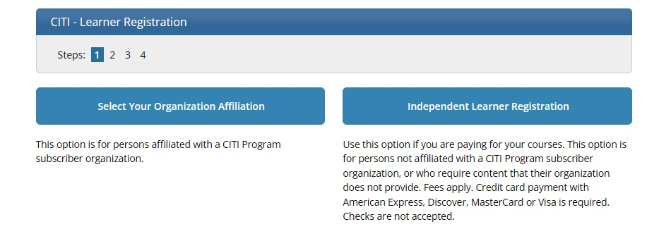
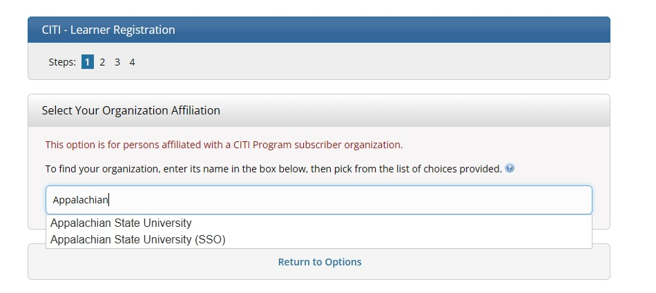

```{r, global_options, include = FALSE}
knitr::opts_chunk$set(
  message = FALSE,
  warning = FALSE,
  comment = NA,
  echo = FALSE,
  fig.align = "center"
)
library(fontawesome)
```

##

***Key Idea***
<hr>
**professional ethics:** Generally, a set of principles that governs how a person in a particular discipline performs their work and relates with fellow professionals, stakeholders, clients, and the public. Most specialty fields have their own rules of conduct.
<hr>

&nbsp;

***Key Idea***
<hr>
**human subject research ethics:** Moral principles for the design and conduct of research involving living people, to ensure that research is done in a way that respects their rights, welfare, and dignity. Key aspects include informed consent, minimizing risks, privacy, and fairly balancing benefits and burdens. 
<hr>


## American Statistical Association | Ethical Guidelines for Statistical Practice (Updated Feb 2022)

The American Statistical Association (ASA) has a [code of ethics](https://www.amstat.org/your-career/ethical-guidelines-for-statistical-practice) for statistical practitioners. This includes everyone who engages in statistical practice, regardless of education level, degree field, job title, or profession. 

The first work on the guidelines began in 1949, but ASA did not formally adopt any code until 1989. A 1999 update emphasized the rights of human/animal subjects and clear communication. Other revisions addressed new challenges such as Big Data. In the future, ASA will likely have to revise the guidelines again to address topics like artificial intelligence.

<mark>We are expected to follow the guidelines and encourage others to do the same.</mark>


## ASA Ethical Principles

**Principle A: Professional Integrity and Accountability** --- Take responsibility for your work. Use valid / appropriate methods. Represent your capabilities and activities honestly.

**Principle B: Integrity of Data and Methods** --- Understand and reduce limitations, defects, and biases in the data and methods. Communicate the potential impacts on results.

**Principle C: Responsibilities to Stakeholders** --- Stakeholders fund, contribute to, use, or are affected by statistical practices. Respect their interests, but they do not supersede ethics.

**Principle D: Responsibilities to Research and Data Subjects, or Those Directly Affected** --- Do not misuse or condone  misuse of data. Protect and respect the rights of subjects, and anyone who will be directly affected by statistical practices.


##

**Principle E: Responsibilities to Members of Multidisciplinary Teams** --- Statistical practice is often done in teams where the members have different professional standards. The statistical practitioner must know how to work ethically in such a team.

**Principle F: Responsibilities to Fellow Statistical Practitioners and the Profession** --- Treat those who practice statistics and the profession with respect, in ways that strengthen our work.

**Principle G: Responsibilities of Leaders/Supervisors/Mentors in Statistical Practice** --- Those who lead, supervise, or mentor people in statistical practice have a specific obligation to follow and promote these ethical guidelines.

**Principle H: Responsibilities Regarding Potential Misconduct** --- We need to understand these guidelines, use due diligence to avoid false allegations while not overlooking possible violations, and adjudicate matters fairly, discreetly, and transparently. 


## 

**APPENDIX: Responsibilities of Organizations/Institutions** --- Organizations or institutions that collect, summarize, process, analyze, interpret, or present data, or that work with models or algorithms, have the responsibility to use statistical practice in ways that are consistent with ASA guidelines, and to promote ethical statistical practice.

<hr>   
<hr>
   
As a statistics instructor and ASA member, it is my responsibility to promote ethical statistical practice among my students.

In this class, we will not be designing studies and collecting data from human subjects for broad research purposes, but at times we will be working with data that was collected from people. In the future, you might also be involved in such research, and we are all increasingly exposed to research results via media.

<hr>   
<hr>

## CITI Research Ethics Training

The 1946--1947 [*Doctors' Trial*](https://encyclopedia.ushmm.org/content/en/article/the-doctors-trial-the-medical-case-of-the-subsequent-nuremberg-proceedings) was one of twelve WWII war-crimes trials that are known collectively as the *Nuremberg Trials*. Horrors had been committed on human beings in the name of "medical" research. Unfortunately, these kinds of grossly unethical actions were not limited to the war years, nor isolated to Nazi territory. In this training, you will learn about the development of human subjects research protections in the United States.

```{r image_grobs, fig.show = "hold", out.width = "50%", fig.align = "default"}
knitr::include_graphics(c("CITIimages/doctorstrial.jpg", "CITIimages/tuskegeeexperiment.jpg"))
```


## CITI Training Website

Go to [https://about.citiprogram.org/](https://about.citiprogram.org/) and choose **Register**.

```{r}
knitr::include_graphics("CITIimages/CITI_01.jpg", dpi = 200)
```


## Select Organizational Affiliation

Choose **Select Your Organizational Affiliation** to get started.

```{r out.width = "100%"}

```


## Choose Appalachian SSO Option

Search for and choose **Appalachian State University (SSO)**. You will be able to sign in with your usual ASU login and password.

```{r out.width = "100%"}

```


## Log In Using Your ASU ID and PW

Check the boxes and **Log In with Appalachian State University**.

```{r}
knitr::include_graphics("CITIimages/CITI_04.jpg", dpi = 125)
```


## Choose "Add a Course" Link

Click the **Add a Course** link to start the search for your course. From here you will be guided through the process required to add the **<mark>Social/Behavioral Research Course---Basic Course</mark>**.

```{r}
knitr::include_graphics("CITIimages/CITI_05.jpg", dpi = 110)
```


## Human Subjects Research

Check the box next to **Human Subjects Research**, then **Next**.

```{r}
knitr::include_graphics("CITIimages/CITI_06.jpg", dpi = 125)
```


## Say NO to Previous Completion

Click **NO, I have NOT completed the Basic Course...**, then **Next**.

```{r}
knitr::include_graphics("CITIimages/CITI_07.jpg", dpi = 125)
```

**If you HAVE done this course in the past, contact Dr. Thomley.** Do not proceed any farther.


## Social & Behavioral Research

Click **Social & Behavioral Research Investigators...**, then **Next**.

```{r}
knitr::include_graphics("CITIimages/CITI_08.jpg", dpi = 125)
```


## Course Is Available to Begin

You should now see the **Social/Behavioral Research Course** in your list of available courses. You do not have to complete the entire course in one sitting. CITI will save your progress.

```{r}
knitr::include_graphics("CITIimages/CITI_09.jpg", dpi = 125)
```


## Start the Course When Ready

When you start the course, you will see at the very top that CITI keeps a running total of your module progress and score. I have completed two modules and I earned a cumulative 100% on the two post-module quizzes.

```{r}
knitr::include_graphics("CITIimages/CITI_10.jpg", dpi = 125)
```


## Course Learning Modules

All course modules are listed, along with your completion dates and quiz scores. This example image shows the first three---two complete and the third ready to start.

```{r}
knitr::include_graphics("CITIimages/CITI_11.jpg", dpi = 135)
```


## Alternate Presentation Modes

When you open a module, you will be given information to read. You can **Switch View** to a video version of the material.

```{r}
knitr::include_graphics("CITIimages/CITI_12.jpg", dpi = 130)
```


## 

You can **Switch View** from the video to the static page as well.

```{r}
knitr::include_graphics("CITIimages/CITI_13.jpg", dpi = 140)
```


## End-of-Module Quizzes

```{r}
knitr::include_graphics("CITIimages/CITI_14.jpg", dpi = 130)
```


##

Each module has a quiz with about 3 multiple choice questions. After you have submitted all questions, you will see the results, including correct answers for missed questions.

```{r}
knitr::include_graphics("CITIimages/CITI_15.jpg", dpi = 130)
```

These results will also show up in the overall list of modules in the ***Social/Behavioral Research Course---Basic Course*** and your records page. Check your cumulative percentage! <mark>You need to get ***80% or better*** overall to pass and get credit.</mark>


## When You Are Done

After you are done with the entire module, go to your records page to verify that you have been marked as complete. Notice that Dr. Thomley has completed more than one CITI course in the last few years.

You should have only one row in your results table if you are new to CITI. Click on **View-Print-Share** to access the evidence you need to submit for STT 1810.

```{r}
knitr::include_graphics("CITIimages/CITI_16.jpg", dpi = 140)
```


## Completion Report

<mark>Click on **Copy Link** for your **Completion Report**. Submit the link in the appropriate assignment on **AsULearn**.</mark> You can see what the report looks like by clicking View/Print.

```{r}
knitr::include_graphics("CITIimages/CITI_17.jpg", dpi = 150)
```


## 

Click on the **Copy `r fa(name = "copy")`** button to copy the link for your submission.

```{r}
knitr::include_graphics("CITIimages/CITI_18.jpg", dpi = 120)
```

<p>&nbsp;</p>
<p>&nbsp;</p>

<hr>
<p style="text-align: center; font-size: 36px;">Congratulations on your achievement!</p>
<hr>

