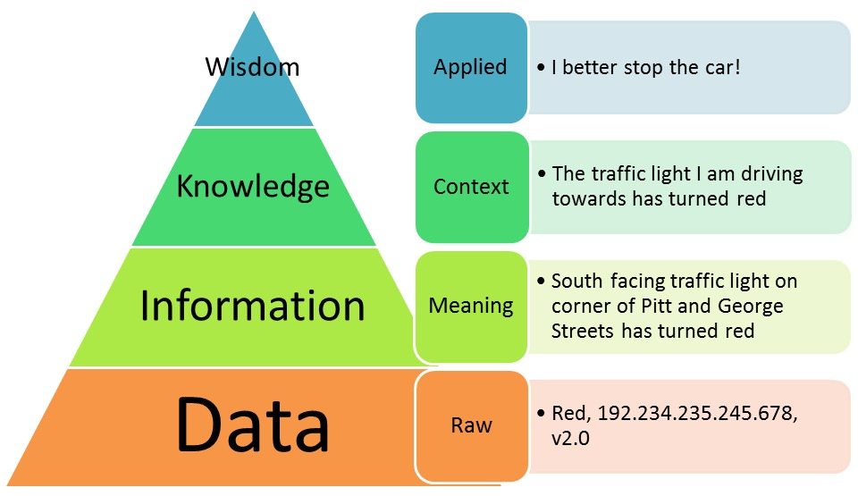
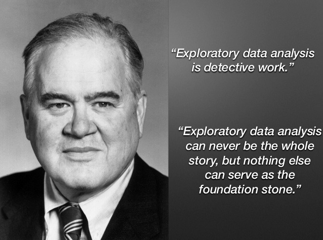

```{r global_options, include=FALSE}
knitr::opts_chunk$set(
  message = FALSE, 
  warning = FALSE,
  comment = NA
)
library(tidyverse)
```

## Before We Begin...

These slides are not meant to be standalone information. You should take notes to flesh out the contents. I recommend that you create an R Markdown document where you can combine information and code from the slides and your own additional notes and explorations to make connections.

**Related Materials**

* Ch05 of [*Introduction to Modern Statistics, 2nd Edition*](https://openintro-ims.netlify.app/explore-numerical)
* Ch02 of [*Modern Dive, 2nd Edition*](https://moderndive.com/v2/viz.html)
* Ch03 of [*Modern Dive, 2nd Edition*](https://moderndive.com/v2/wrangling.html)
* DataCamp [*Introduction to the Tidyverse*](https://www.datacamp.com/courses/introduction-to-the-tidyverse)
* DataCamp [*Data Manipulation with dplyr*](https://app.datacamp.com/learn/courses/data-manipulation-with-dplyr)
* DataCamp [*Introduction to Data Visualization with ggplot2*](https://app.datacamp.com/learn/courses/introduction-to-data-visualization-with-ggplot2)

##

<p style="text-align:center;"></p>

We process raw ***data*** with statistical methods to extract usable ***information***. But that is only part of the story! To give statistical results meaning and learn from them, we must interpret them in the ***appropriate context***. This includes units of measurement.

## 

<p>John Tukey (1915--2000), noted mathematician, statistician, and computer scientist, author of _Exploratory Data Analysis_ (1977)<p>

<p style="text-align:center;"></p>

<p>Tukey also advocated for development of computerized tools to facilitate EDA, so people could focus on ***interpreting results***.</p> 

## How We Describe Data Distributions

**Categorical Variables**

* frequency / relative frequency

Summaries based on *counting* how often categories occur.

**Numerical Variables**

* shape
* center
* spread
* outliers

*Shape*, *center*, and *spread* characterize the distribution pattern of numerical variables. *Outliers* are deviations from the pattern.

## Shape

* Visual assessment: how many peaks does it have?
    * unimodal, bimodal, or multimodal

* Visual assessment: is it approximately symmetric?
    * symmetric, right skewed, or left skewed

* Skewness statistic 
    * numerical quantification of the degree of asymmetry

* Kurtosis statistic
    * numerical quantification of peak and tails conformation

We rely heavily on plots to assess the shape of a distribution. A determination of skewness can be difficult with a small sample or more than one mode. Summary measures like skewness and kurtosis should be interpreted ***along with plots***.

## Some Possible Shapes

We often see symmetric, mound-shaped distributions like the top left. Does it look familiar to you? However, infinitely many shapes are possible.

```{r, echo = FALSE, fig.align="center"}
knitr::include_graphics("images/histogramshapes.png", dpi = 75)
```

## What is a Histogram?

A ***histogram*** is a type of bar plot for displaying the distribution of a numerical variable.

* The number line in the data's range is divided into intervals known as "bins"
* These bins are of equal width and continuous (i.e., no gaps between them) 
* The frequency for each bin is the number (count) of data points that fall into that bin 
* Every data point must be included in exactly one bin, with no data points left out

There are many possible ways to create a histogram for a given dataset, depending on our choice of bins. Usually we have to try more than one possibility.

## Rules of Thumb for Number of Bins

* some sources say between 5 and 15 bins
* other sources say between 5 and 20 bins
* Freedman-Diaconis rule, about $2 \times IQR × n^{−1/3}$ bins
* Sturge’s rule, number of bins around $1 + 3.322 \times log(n)$
* **a good rule is to start with a number of bins near** $\sqrt{n}$

Recall, $n$ is the number of data points in the plotted sample.

Finding an appropriate number of bins is an interative process. In `R` you can set an (approximate) number of bins, *or* choose a specific bin width, *or* specify the exact boundaries you want for the bins. Overall, we want to strike a balance between detail and "smoothness".

## What is a Density Plot?

A ***frequency polygon*** connects the midpoints of histogram bins to display a very rough estimate of a continuous distribution.

A ***density plot*** is a variation on a histogram that uses a statistical technique called *kernel smoothing* to plot a smoothed estimate of a variable's distribution over some continuous interval of the number line. It "averages" multiple bars, roughly speaking.

Density plots are often better at displaying the shape of a true continuous distribution than a histogram because they're not affected by the number of bins we choose the way histograms can be. However, differences in the algorithm (e.g., "bandwidth" used) can over- or under-smooth the distribution.

The specifics of kernel smoothing are beyond the scope of this class, but we can create these plots in `R` and `ggplot2`.

## Center

* mean (symbolized $\mu$ for a population, $\bar{x}$ for a sample)
    * arithmetic mean ("average", _expected value_)
    * weighted mean (some points have more "weight")
    * trimmed mean (some end points are trimmed off)
    * geometric mean (n^th^ root of the product of n values)
* median (50^th^ percentile/quantile)
* mode (most common value, used more to discuss shape)

Mean and median are both the "middle" of a given distribution, but the two summaries define middle or _center_ differently. They may be very different values when calculated. If a distribution is perfectly symmetric, then the mean and median will be equal.

## Spread (or *Variability*)

* variance (*variance* is one specific measure of *variability*)
    * population (symbolized $\sigma^2$)
    * sample (symbolized $s^2$)
* standard deviation
    * population (symbolized $\sigma$)
    * sample (symbolized $s$)
* mean / median absolute deviation (MAD and ... MAD?)
* interquartile range (IQR)
* range

Summarizing the deviations of a set of values from some center point (like the mean) is a common technique in statistics. 

## Measures Based on Ordered Counts

* five-number-summary
    * minimum is the smallest data point
    * first quartile (Q<sub>1</sub>) has 25% of the data below, 75% above
    * median has 50% of the data below, 50% above ("center")
    * third quartile (Q<sub>3</sub>) has 75% of data the below, 25% above
    * maximum is the largest data point
* interquartile range (IQR) = Q<sub>3</sub> -- Q<sub>1</sub> (range of the middle 50%)
* range = maximum -- minimum (overall width of the dataset)
* percentiles / quantiles are quantities where the $n^{th}$ percentile has $n\%$ of the data below it and $n-1\%$ above it (e.g., Q<sub>1</sub> is the 25th percentile and the median is the 50th percentile)

## Measures Based on Moments: Mean

In physics, a *moment of force* (or *torque*) is the turning effect of the force about a central point, as a function of distance from the point. Statistical moments are a similar idea.

**mean (first moment $M_1$)**

* $x - \mu$ calculates the distance of point $x$ from the mean $\mu$
* $\mu$ is the value that makes $\sum_{\text{all x}}(x_i - \mu)^1 = 0$ true for all points $x_i$ in a given distribution
* this is the distribution's **center of mass** or *balancing point*

Think of the number line as a see-saw and the data points as objects sitting on the see-saw, exerting a downward force. The mean is the fulcrum that perfectly balances all the data points and keeps the see-saw level.

## Variance and Standard Deviation

**variance (second moment)**

$$M_2 = \sigma^2 = \frac{\sum_{\text{all x}}(x - \mu)^2}{n}$$

The variance is the average *squared* distance of all points from the mean. Points that are farther away from $\mu$ will be weighted somewhat more heavily. Whatever units of measure variable $X$ has will be squared as well, so it is less useful for description.

$$\text{standard deviation} = \sqrt{\text{variance}} = \sigma $$

While not strictly mathematically true, it is helpful to think of $\sigma$ as roughly the average distance of all points from the mean. Its units are the same as the mean and the actual data values.

## Population vs. Sample Variance

The previous slide shows the formula for *population* variance. 

When we compute sample variance, we make a small change to the formula so that it is an *unbiased* estimator of the population variance. $E(s^2) = \sigma^2$, so in the long run $s$ will not consistently over-estimate or under-estimate $\sigma^2$. For a sample of size $n$ ...

$$\text{sample variance} = s^2 = \frac{\sum_{i=1}^n(x_i - \bar{x})^2}{n-1}.$$ 

$$\text{sample standard deviation} = \sqrt{\text{sample variance}} = s$$

Notice that parameters are usually Greek letters, while statistics are usually English letters ... but not quite always. If you are not yet familiar with the symbols, this is a good time to learn!

## $Z$-Score (Standardized Score)

Mean and standard deviation have the same units as the data (e.g., heights in inches have a mean expressed in inches). 

However, standard deviation itself can be a unit of measure. The $z$-score tells us how many standard deviations above or below the mean a given point $x$ is located.

$$z = \frac{x - \mu}{\sigma} \text{ (population)}$$

$$z = \frac{x - \bar{x}}{s} \text{ (in a sample)}$$

The data units cancel out. A $z$-score of $+2$ would be interpreted as "two standard deviations above the mean".

## The Mathematics of $Z$-Scores

Why are $z$-scores *standardized* scores? The calculation performs a linear transformation (re-scaling) of the values, similar to when we convert degrees Fahrenheit to Celsius. Data points maintain their relative relationships to each other, we are just using a new number line scale as a reference point.

$(x - \mu)$ re-centers the data, and the new mean is always zero

dividing by $\sigma$ re-scales the number line, so the SD is always one

The act of dividing also cancels out original measurement units. We then talk about data points in terms of how many standard deviations they are above or below the mean. It helps compare variables that may originally have been on very different scales by using a common or *standard* scale.

## Why do We Need $Z$-Scores?

As noted, $z$-scores help us compare data and distributions that may be measures on different scales, the way we might convert measurements made in inches, feet, and meters to a common set of units to make more direct comparisons. 

Our traditional methods of estimation and inference also often rely on using standardized measures so that we can use these same methods in a broad variety of situations. In statistics, our data is an unknown, but the same way scientists calibrate their instruments, we make sure our statistical methods are reliable by validating and "calibrating" them mathematically.

In the future, one variation you see on $z$-scores will be *t*-scores, used for estimation and inference about means.

## Skewness and Kurtosis

skewness (based on the third moment, notice $z$-score similarity)

$$M_3 = \frac{\sum_{\text{all x}}(x_i - \mu)^3}{n}$$

$$skewness = \frac{\sum_{\text{all x}}(x_i - \mu)^3}{\sigma^3}$$

kurtosis (based on the fourth moment, notice $z$-score similarity)

$$M_4 = \frac{\sum_{\text{all x}}(xI - \mu)^4}{n}$$

$$kurtosis = \frac{\sum_{\text{all x}}(x_i - \mu)^4}{\sigma^4}$$

## More on Skewness, Kurtosis, Moments

Skewness and kurtosis help to judge the *shape* of a distribution. 

* skewness is the degree of asymmetry in the distribution   
* kurtosis is the flatness or peakedness of the distribution

They are *standardized* by dividing the summed deviations by $\sigma$ raised to the same power as the moment, similar to $z$-scores. 

We use these measures often when trying to judge whether or not we can consider a variable to be approximately bell-shaped, since many of our traditional methods assume this.

**Outliers affect all measures based on moments**, so we need to check for them. Summaries that are based on counts tend to be more **robust**, but less mathematically tractable for some uses.

## Summarizing Using dplyr

You can add/remove summary functions as needed. The `na.rm` ignores any `NA` (missing) values, else you get `NA` as output.

```{r, eval = FALSE}
datasetname %>%   # skewness and kurtosis require the moments package
  summarize(n     = n(),
            xbar  = mean(variablename, na.rm = TRUE),
            s     = sd(variablename, na.rm = TRUE),
            xmin  = fivenum(variablename)[1],
            Q1    = fivenum(variablename)[2],
            xmed  = fivenum(variablename)[3],                  
            Q3    = fivenum(variablename)[4],
            xmax  = fivenum(variablename)[5],
            iqr   = IQR(variablename, na.rm = TRUE),
            rng   = diff(range(variablename, na.rm = TRUE)),
            total = sum(variablename, na.rm = TRUE),
            skew  = skewness(variablename, na.rm = TRUE),
            kurt  = kurtosis(variablename, na.rm = TRUE))
```

## About the `fivenum()` Function

Most summary functions like `mean()` and `sd()` produce only a single value as output. However, `fivenum()` produces a vector of length 5. The [ ] notation accesses the correct location in the output vector, since each step of a `summarize()` function must only output a single value.

```{r}
library(resampledata)
fivenum(FlightDelays$FlightLength) # output is min, Q1, med, Q3, max
fivenum(FlightDelays$FlightLength)[3] # output is location 3, median
```

## The `quantile()` Function

With `quantile()` you can specify one or more quantiles to find. The default is the five-number summary. The output is a vector.

```{r}
quantile(FlightDelays$FlightLength)

quantile(
  FlightDelays$FlightLength,
  probs = c(.1, .2, .3, .4, .5, .6, .7, .8, .9)   # deciles
)
```