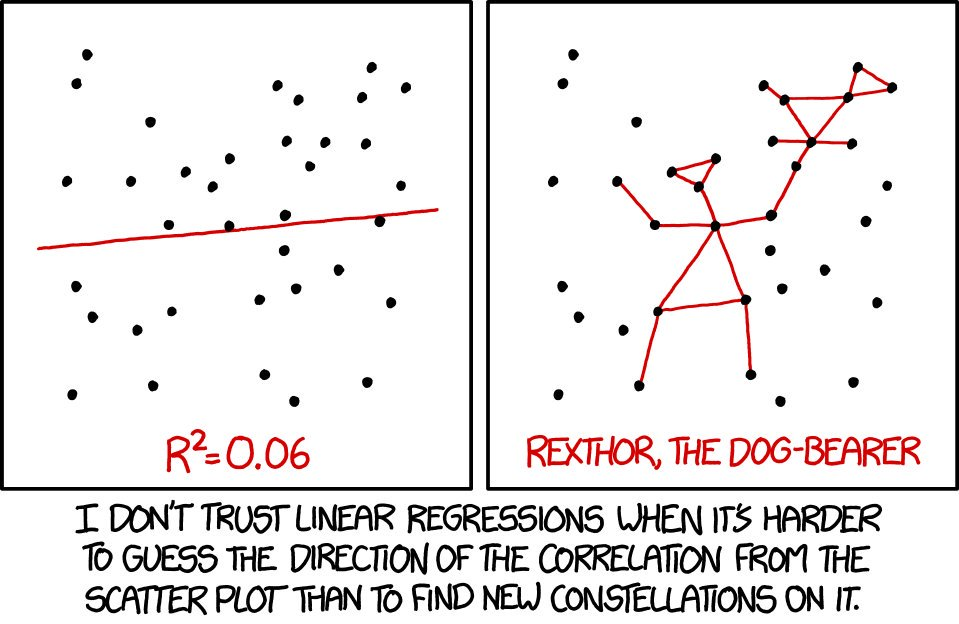

```{r global_options, include=FALSE}
knitr::opts_chunk$set(
  message = FALSE, 
  warning = FALSE,
  comment = NA
)
```

## Before We Begin...

These slides are not meant to be standalone information. You should take notes to flesh out the contents. I recommend that you create an R Markdown document where you can combine information and code from the slides and your own additional notes and explorations to make connections.

**Related Materials**

* Ch07 of [*Introduction to Modern Statistics, 2nd Edition*](https://openintro-ims.netlify.app/model-slr)
* Ch08 of [*Introduction to Modern Statistics, 2nd Edition*](https://openintro-ims.netlify.app/model-mlr)
* Ch 5 of [*Modern Dive*](https://moderndive.com/v2/regression.html)
* Ch 6 of [*Modern Dive*](https://moderndive.com/v2/multiple-regression.html)
* DataCamp [Modeling with Data in the Tidyverse](https://learn.datacamp.com/courses/modeling-with-data-in-the-tidyverse)


## The Concept of Modeling

<h3 style="text-align: center;">What is a model?</h3>

<p style="text-align: center;"></p>

<h3 style="text-align: center;">What is a *mathematical* model?</h3>


## 

**model** (in general)

* A representation that is meant to emulate reality, but which is often smaller or simpler than the real-world process or object we want to study. These pared-down representations allow us to focus on important components or relationships.

**mathematical model** 

* A representation using math or probability tools that is meant to closely match reality, but always making *assumptions* about that reality, which may or may not be true. **Statistical** models usually include some kind of random component.

**probability/chance model**

* A physical or digital process to generate/simulate data, based on a specified set of conditions.


## A General Model

General modeling framework: $y$ is a function of one or more $x$ variables, plus some amount of random error.

$$y = f(\overrightarrow{x}) + \epsilon$$

* $y$ is the *outcome*, *response*, or *predicted* variable

* $x$ is an *explanatory*, *predictor*, or *regressor* variable ("signal")

* $\epsilon$ is the unsystematic error component ("noise")

The function $f(\overrightarrow{x})$ can assume a variety of forms, depending on the system and relationships we are trying to model. Finding the right model is can be an iterative process. We often assume that $\epsilon$ is a normally distributed random variable.


## Goals of Modeling

There are two primary reasons we fit statistical models to data.

(1) We want to quantify and **explain** how one or more variables<br>($x$) are associated with the response variable ($y$), how strong those associations are, and how changing the values of these explanatory variables impacts the response.

(2) We want to use the resulting model to **predict** values of the response variable ($y$), using some set of observed values for the explanatory or predictor variables ($x$). We might not be concerned about the nature of the relationships, but rather with making the best predictions possible.

Often, we want to achieve both goals in our modeling process. Both are made challenging by the error component.


## Simple Linear Model

Our theoretical simple linear model has the following form, with $f(x)$ being the familiar equation of a straight line.

$$y = f(x) + \epsilon = \beta_0 + \beta_1 x + \epsilon$$

We use data to estimate the $\beta$ parameters. The observed value of the $i^{th}$ data point $y_i$ in the sample can be expressed in terms of the fitted line and a residual (deviation from the line).

$$y_i = b_0 + b_1 x_i + e_i$$

The fitted (predicted) value $\hat{y}_i$ is a point lying on the fitted line, obtained by plugging the value $x_i$ into the fitted line. 

$$\hat{y}_i = b_0 + b_1 x_i \rightarrow y_i = \hat{y}_i + e_i$$

## Visualizing Residuals

```{r, echo = FALSE, out.width = "100%"}
knitr::include_graphics("https://miro.medium.com/max/700/1*uoGLR9T-6_1hIlPhu2d_rg.png")
```

## "Best Fit" (Method of Least Squares)

The residual for each data point is the difference between the observed value of $y$ and the predicted value $\hat{y}$.

$$y_i - \hat{y}_i = (b_0 + b_1 x_i + e_i) - (b_0 + b_1 x_i) = e_i$$


In ***least squares*** modeling, the best-fitting line for $n$ data points:

* Passes through the point $(\bar{x}, \bar{y})$

* Sum of the residuals $\sum_{i=1}^{n} e_i$ is equal to zero

* Sum of the squared residuals $\sum_{i=1}^{n} {e_i}^2$ is minimized

The sum of squared residuals (SSE) is an important quantity in regression analysis and is used for several purposes.


## Least Squares Slope and Intercept

The least squares line always passed through the point $(\bar{x}, \bar{y})$. We calculate slope by finding the product of the deviations of the paired $(x, y)$ values from their respective means, sum the products, then scale the sum by the variance of the $x$ variable. Notice the similarities between variance and covariance.

$$b_1 = \frac{\text{covariance}(x,y)}{\text{variance}(x)} = \frac{s_{xy}^2}{s_x^2} =$$

$$\frac{\displaystyle \frac{\sum_i (x_i - \bar{x})(y_i - \bar{y})}{n-1}}{\displaystyle \frac{\sum_i (x_i - \bar{x})^2}{n-1}} = \frac{\sum_i (x_i - \bar{x})(y_i - \bar{y})}{\sum_i (x_i - \bar{x})^2}$$


##

This formulation for finding slope is an algebraic simplification of the [linear algebra](https://online.stat.psu.edu/stat462/node/132/) method, which extends to cases with more that one predictor variable. It is related to the familiar "rise over run" concept from geometry.

We will see that this also connects to the correlation coefficient. Both slope and correlation are functions of the variability of the data points in the $xy$ plane.

<hr>

Since the least squares line always passes through $(\bar{x}, \bar{y})$, once we have found the slope $b_1$, we can solve for the intercept $b_0$ by plugging in the three known values. 

$$
\begin{aligned}
\hat{y}_i &= b_0 + b_1 x_i \\[0.25em]
\bar{y} &= b_0 + b_1 \bar{x} \\[0.25em]
b_0 &= \bar{y} - b_1 \bar{x} 
\end{aligned}
$$


## Interpreting Slope and Intercept

Mathematically, the y-intercept $\beta_0$ and its estimate $b_0$ represent the value of $\hat{y}$ when $x = 0$. 

The intercept term may or may not have a useful interpretation in context, depending on whether $x$ = 0 is meaningful. 

The units of measure for the intercept are the same as the units of measure for the $y$ variable.

<hr>

Slope is a rate of change; how many units of measure does the $\hat{y}$ value change when $x$ changes by one unit.

Since slope is a rate ($\Delta y$ / $\Delta x$), the units of measure for slope are ($y$ units of measure / $x$ units of measure).


## Strength of Linear Relationship

The strength of the linear relationship between two quantitative variables can be quantified using the Pearson product-moment correlation coefficient, or Pearson correlation. 

The Pearson correlation is a standardized and unitless measure, scaled from $-1$ (perfect linear relationship with negative slope) to $+1$ (perfect linear relationship with positive slope).

$$-1 \le r \le +1 \text{ (never expressed as a percentage!)}$$

$$r = \frac{1}{n-1}\sum_i \left(\frac{x_i-\bar{x}}{s_x}\right)\left(\frac{y_i-\bar{y}}{s_y}\right) = \frac{1}{n-1}\sum_i z_{x_i}z_{y_i}$$

Take the product of the $z$-scores of each $(x, y)$ pair, sum them, and divide the sum by $n-1$ (since we use sample $s_x$ and $s_y$).
 
## 

If there is no pattern and the best-fitting line has zero slope, the Pearson correlation is zero. The magnitude of the correlation is the **strength**, the sign tells us the slope **direction**.

```{r, echo = FALSE, out.width = "90%", fig.align = "center"}
knitr::include_graphics("https://moderndive.com/v2/ModernDive_files/figure-html/correlation1-1.png")
```
<div style = "text-align: center; font-size: 18px;">image source: https://moderndive.com/v2/regression.html</div>


## Slope from Correlation

Recall the expression for the correlation coefficient. Rearrange the expression as follows to display $r$ more clearly in terms of covariance and standard deviations rather than $z$-scores.

$$
\begin{aligned}
r &= \frac{1}{n-1}\sum_i \left(\frac{x_i-\bar{x}}{s_x}\right)\left(\frac{y_i-\bar{y}}{s_y}\right) \\[0.5em]
&= \frac{1}{n-1} \times \frac{1}{s_xs_y} \times \sum_i (x_i-\bar{x})(y_i-\bar{y})\\[0.5em]
&= \frac{\displaystyle\frac{\sum (x_i - \bar{x})(y_i - \bar{y})}{n-1}}{s_xs_y} = \frac{s_{xy}^2}{s_xs_y} \\[0.5em] 
\end{aligned}
$$


##

How can we compute the slope from the correlation coefficient? 

$$
\begin{aligned}
b_1 &= Ar \\[0.25em]
\frac{s_{xy}^2}{s_x^2} &= A\frac{s_{xy}^2}{s_xs_y} \\[0.6em]
\frac{s_{xy}^2}{s_x \times s_x} &= A\frac{s_{xy}^2}{s_x \times s_y} \\[0.6em]
A = \frac{s_y}{s_x} &\rightarrow b_1 = \frac{s_y}{s_x}r
\end{aligned}
$$

Conceptually, we take the unitless correlation coefficient, which tells us the strength of the linear relationship between $x$ and $y$, and adjust the value so that slope of the line reflects the units or scales of the $x$ and $y$ variables.


## Cautions! Beware Outliers...

You may have noticed by now that the mathematics in simple least squares regression centers around the point $(\bar{x}, \bar{y})$ and the deviations from that point. As we learned, moment-based summary measures are not robust against outliers. 

Thus, we need to be cautious about any *univariate* outliers that may be in our data exerting unusual influence.

In addition, since we are trying to minimize the sum of squared errors from the line, bivariate outliers may also be a problem. A point that does not fit the overall $(x,y)$ pattern and lies far from the line may be a *bivariate* outlier.

Not all univariate outliers are bivariate outliers. Conversely, not all bivariate outliers are univariate outliers. 


## Variance of the Residuals

For the least squares line, $\sum_i e_i = 0$, and so $\bar{e} = \sum_i e_i/n$. We estimated two parameters for the regression model, reflected in the denominator of the error variance.

$$s_{error}^2 = \frac{\sum_i e_i^2}{n-2} = \frac{SSE}{n-2}$$

We also said earlier that, for the least squares line, the sum of the squared residuals $SSE = \sum_i {e_i}^2$ is minimized. 

Using least-squares methodology, the best-fitting line is the one that minimizes the least squared error (i.e., error variance) and maximizes the proportion of variability in $y$ that is explained by the model $f(x)$.


## Assessing the Fit of the Line Using $R^2$

The *coefficient of determination* $R^2$ is the proportion of variation in the $y$ variable explained by the model. Recall, $y_i = \hat{y}_i + e_i$. We partition the variation in $y$ between model ($x$) and error. 

$$R^2 = \frac{SSM_{odel}}{SST_{otal}} = 1 - \frac{SSE_{rror}}{SST_{otal}} = 1 - \frac{\sum_i e_i^2}{\sum_i (y_i-\bar{y})^2}$$

$0 \le R^2 \le 1$ (proportion) or $0\% \le R^2 \le 100\%$ (as a percent)

For a deterministic relationship where $x$ perfectly predicts $y$, we will see $R^2 = 1$ or $100\%$ (all variation in $y$ explained by $x$).

If $x$ and $y$ have no relationship with respect to the fitted model, $R^2 = 0$ or $0\%$ (none of the variation in $y$ explained by $x$).


## $R^2$ as a Measure of Model Fit?

$R^2$ is often used to assess model fit and to compare potential models for the same data. In general, larger values indicate a better model fit. This measure also can be affected by outliers and non-linearity, so be careful.

```{r, echo = FALSE, fig.align="center"}

```


## Slope vs. Correlation vs. $R^2$

In simple linear regression modeling, these three statistics are closely related. In fact, they are direct functions of one another. As we saw, the slope $b_1$ is the correlation coefficient $r$ scaled by the standard deviations of the x and y variables. 

$$b_1 = r \frac{s_y}{s_x}$$

Algebraically, for simple linear regression, $R^2$ will be the square of the Pearson correlation coefficient. Here is a [proof](https://economictheoryblog.com/2014/11/05/proof/).

$$R^2 = (r)^2$$

The Pearson correlation coefficient will be the square root of $R^2$ with the appropriate positive or negative sign applied.


## An Additional Model Summary

Mean Square Error (MSE) is the average squared distance of the residuals from the line.

$$MSE = \frac{\sum_i e_i^2}{n}$$

RMSE (square *R*oot of MSE) is a standardized deviation of model residuals. We can think of this as the "typical" size of residuals in the model. In general, the smaller the RMSE, the better predictor the model ought to be. However, the quality of prediction must be assessed in the context of the problem.

$$RMSE = \sqrt{\frac{\sum_i e_i^2}{n}}$$

